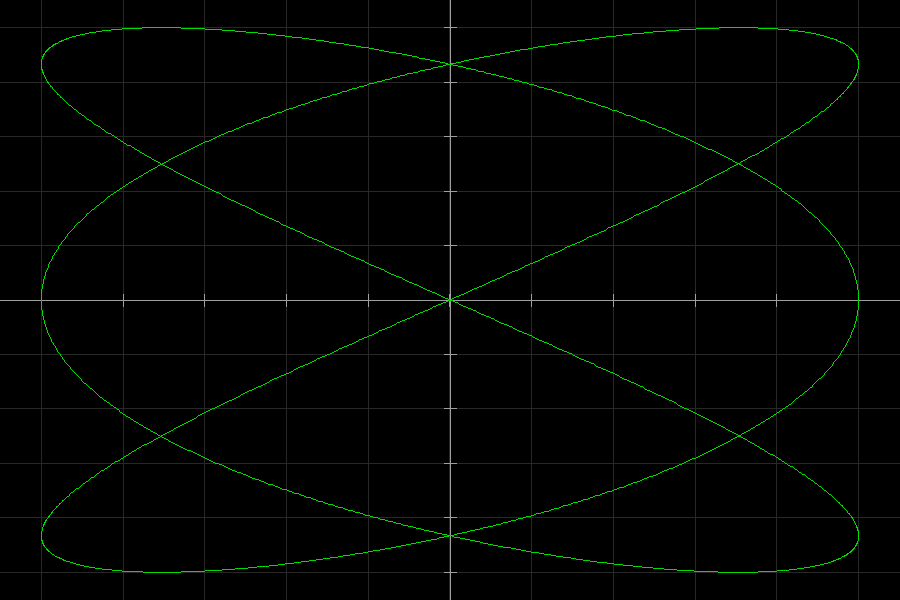
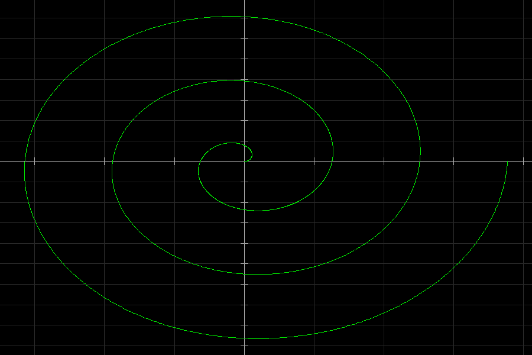
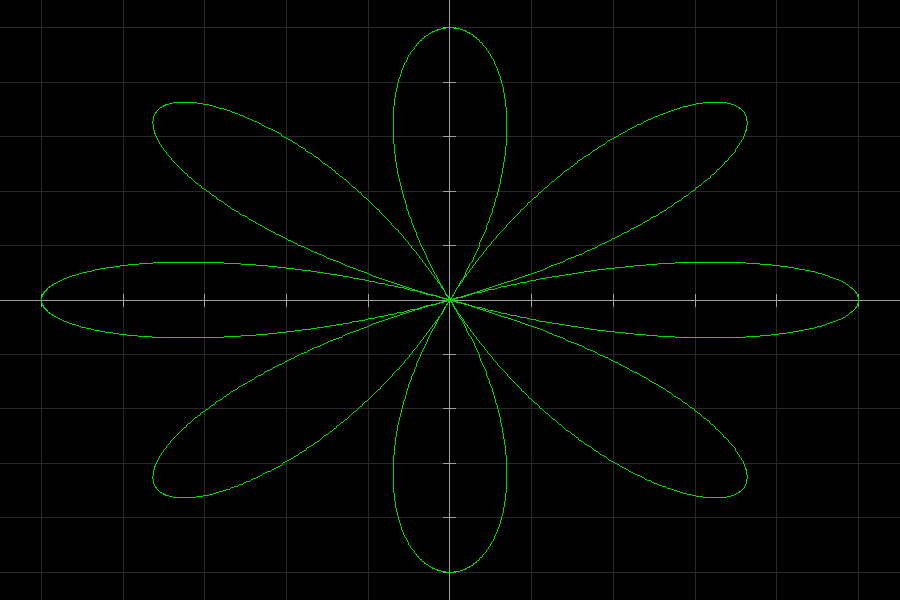
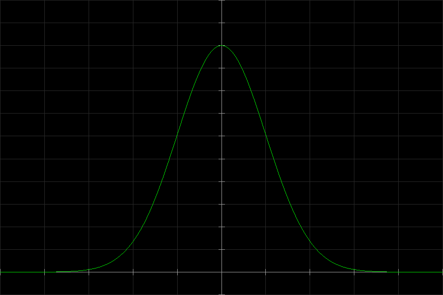
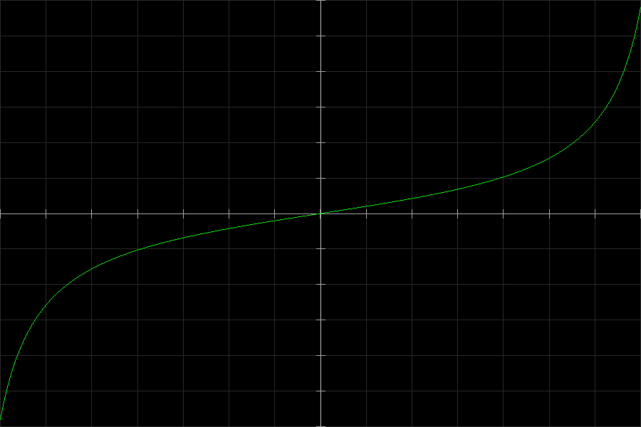

# Plot-in-c

Um **plotter 2D de funções matemáticas** feito em **C99** + **SDL2**, com um parser inspirado em **TeX/LaTeX** (subset) que constrói uma **AST** e avalia `f(x)` em tempo real.

- **C99 raiz** (`-std=c99 -Wall -Wextra -pedantic`)
- **SDL2** para render 2D (grid, eixos, curva)
- **Parser próprio** (tokenização → AST → `eval`)
- **Curvas paramétricas** com tuplas `(x(t), y(t))`
- **Screenshot** (BMP) via tecla **P** ou `--shot`

> Repositório: este projeto vive em `plot-in-c/` (binário em `./bin/tatuplot`).

---

## Galeria

| Coração (paramétrica) | Lissajous (paramétrica) | Espiral (paramétrica) |
|---|---|---|
|  |  |  |

| Rosa (paramétrica) | Sinc (cartesiana) | Gauss (cartesiana) | Tan (cartesiana) |
|---|---|---|---|
|  |  |  |  |

---

## Requisitos

### Arch Linux (recomendado)
```bash
sudo pacman -Syu
sudo pacman -S gcc make git sdl2
```

Verificar:
```bash
gcc --version
sdl2-config --cflags --libs
```

---

## Build

Na raiz do projeto:

```bash
make
```

Executar:
```bash
make run ARGS='--expr "\sin(x)"'
```

Limpar:
```bash
make clean
```

---

## Uso (CLI)

```bash
./bin/tatuplot --expr "<expressao>" [opcoes]
```

Opções principais:

- `--expr "..."` (**obrigatório**) expressão estilo TeX (subset)
- `--xmin A --xmax B` range do eixo X *(ou range de `t` se a expressão for tupla e `--tmin/--tmax` não forem passados)*
- `--ymin C --ymax D` range do eixo Y
- `--tmin T --tmax U` range do parâmetro `t` (modo paramétrico)
- `--width W --height H` tamanho da janela (default `900x600`)
- `--bg R,G,B` cor do fundo (default `0,0,0`)
- `--fg R,G,B` cor do gráfico (default `0,220,0`)
- `--out caminho.bmp` caminho do screenshot (default `tatuplot.bmp`)
- `--shot` renderiza 1 frame, salva screenshot e **sai** (ótimo para README/CI)

---

## Controles (janela)

- **W A S D**: pan (mover viewport)
- **+ / -**: zoom in / zoom out (no centro)
- **R**: reset do viewport para o estado inicial
- **P**: salva screenshot (BMP) em `--out`
- **ESC**: sair

---

## Sintaxe suportada (subset TeX v1+)

### Tokens/estruturas
- números: `1`, `3.14`
- variável: `x`
- constantes: `pi`, `e`
- operadores: `+  -  *  /  ^`
- parênteses: `( ... )`
- chaves: `{ ... }` (equivalente a parênteses no parser)
- multiplicação implícita: `2x`, `x\sin(x)`, `(x+1)(x-1)`

### Comandos
- unárias: `\sin`, `\cos`, `\tan`, `\log`, `\exp`, `\sqrt`
- fração: `\frac{a}{b}`
- wrappers/no-op (ignorados): `\left`, `\right`
- espaçamentos (ignorados): `\;`, `\,`, `\:`, `\!`

### Potência no estilo TeX
- `\sin^{3}(x)` é aceito e vira `(sin(x))^3`

### Curvas paramétricas (tupla)
Se a expressão principal for uma tupla:
- `(exprX, exprY)` **ou** `{exprX, exprY}`

o programa entra em **modo paramétrico** e plota a curva com parâmetro `t`.

**Regra de ranges no modo paramétrico:**
- se você passar `--tmin/--tmax`, eles definem o parâmetro `t`
- se você **não** passar `--tmin/--tmax`, então `--xmin/--xmax` é interpretado como **range de `t`** (compatível com o comando do coração)
- o viewport **X do gráfico** pode ser auto-ajustado (auto-fit) conforme a curva

---

## Exemplos (7 “funções legais”)

> Dica: use `make run ARGS='...'` para evitar briga com escapes do shell.

### 1) Coração (paramétrica)
```bash
make run ARGS='--expr "\left(16\sin^{3}(x),\;13\cos(x)-5\cos(2x)-2\cos(3x)-\cos(4x)\right)" --xmin 0 --xmax 6.283185307179586 --ymin -18 --ymax 14'
```

### 2) Lissajous (paramétrica)
```bash
make run ARGS='--expr "(\sin(3x),\sin(2x))" --xmin 0 --xmax 6.283185307179586'
```

### 3) Espiral (paramétrica)
```bash
make run ARGS='--expr "(x\cos(x),x\sin(x))" --xmin 0 --xmax 18.84955592153876'
```

### 4) Rosa (paramétrica)
```bash
make run ARGS='--expr "(\cos(4x)\cos(x),\cos(4x)\sin(x))" --xmin 0 --xmax 6.283185307179586'
```

### 5) Sinc (cartesiana)
```bash
make run ARGS='--expr "\frac{\sin(x)}{x}" --xmin -20 --xmax 20 --ymin -0.5 --ymax 1.2'
```

### 6) Gaussiana (cartesiana)
```bash
make run ARGS='--expr "e^{-\frac{x^2}{2}}" --xmin -5 --xmax 5 --ymin -0.1 --ymax 1.2'
```

### 7) Tangente (cartesiana)
```bash
make run ARGS='--expr "\tan(x)" --xmin -1.4 --xmax 1.4 --ymin -6 --ymax 6'
```

---

## Gerando screenshots

### Pasta recomendada
```bash
mkdir -p screenshots
```

### Screenshot automático (salva e sai)
Use `--shot` + `--out`:

```bash
make run ARGS='--expr "\tan(x)" --xmin -1.4 --xmax 1.4 --ymin -6 --ymax 6 --out screenshots/tan.bmp --shot'
```

### Converter BMP → PNG (para o GitHub renderizar na galeria)

Instalar ImageMagick (opcional, só pra converter):
```bash
sudo pacman -S imagemagick
```

Converter em lote:
```bash
for f in screenshots/*.bmp; do
  magick "$f" "${f%.bmp}.png"
done
```

Depois, você pode commitar os `.png` e manter (ou apagar) os `.bmp`.

---

## Estrutura do projeto

```
plot-in-c/
├── assets/
├── bin/               # binários (tatuplot)
├── build/             # objetos .o
├── docs/
├── include/           # headers
├── src/               # fontes .c
├── screenshots/       # imagens geradas (recomendado)
├── Makefile
└── README.md
```

---

## Troubleshooting

### 1) Erros de link com `log10`, `pow`, `lround`…
Isso acontece quando falta linkar a **libm** (`-lm`).
O `Makefile` deve ter `-lm` na etapa de link.

### 2) Wayland / libdecor-gtk warning
Em alguns ambientes Wayland pode aparecer:
- `libdecor-gtk-WARNING: Failed to initialize GTK`
- `Failed to load plugin 'libdecor-gtk.so'`

Se o programa abre a janela e roda normal, dá pra ignorar.
Se der problema de janela/decoração, alternativas:
- instalar dependências do libdecor (se você usa Wayland):
  ```bash
  sudo pacman -S libdecor libdecor-gtk
  ```
- ou forçar X11:
  ```bash
  SDL_VIDEODRIVER=x11 ./bin/tatuplot --expr "\sin(x)"
  ```

---

## Roadmap (ideias legais)

- zoom/pan com mouse (scroll + drag)
- export para PNG nativo (sem conversão)
- anti-aliasing / supersampling
- mais comandos TeX (`\ln`, `\abs`, `\arctan`, etc.)
- mensagens de erro com “setinha” apontando a coluna do parse
- modo “repl” no terminal para testar expressões sem abrir janela

---

## Contribuindo

PRs e issues são bem-vindos — principalmente para:
- ampliar o subset TeX com cuidado (sem “explosão” de dependências)
- testar em diferentes ambientes (Wayland/X11)
- melhorar robustez do parser e mensagens de erro